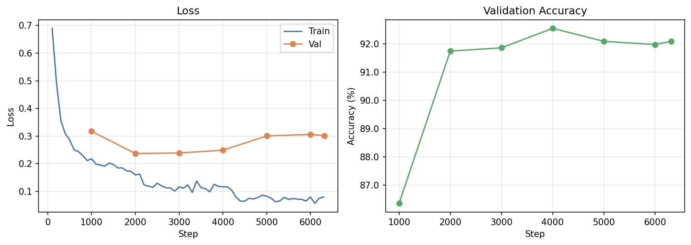
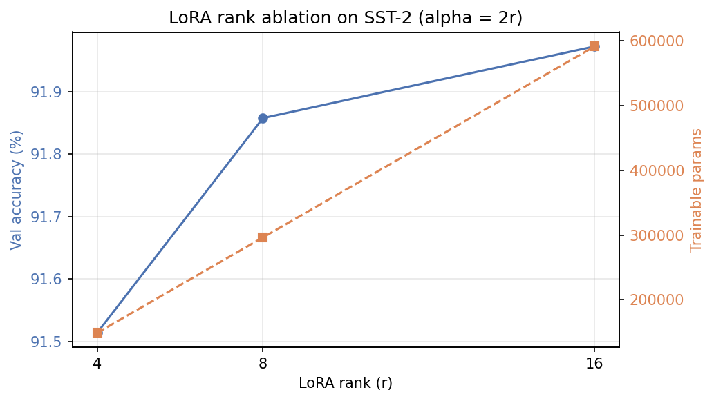

# BERT Sentiment Fine-tuning Practice

Fine-tuning `bert-base-uncased` on SST-2 for binary sentiment classification, comparing **full fine-tuning** against **LoRA** (parameter-efficient fine-tuning).

## Takeaway

**Pre-trained representations transfer remarkably well.**
BERT jumps from ~51% (random head) to 93.3% in 3 epochs. Almost all the signal is already in the weights — fine-tuning just steers the classifier.

**Task-specific adaptation is low-dimensional.**
LoRA hits 91.3% updating only 0.27% of parameters. The information needed to adapt to SST-2 lives in a very small subspace of the weight updates.

**Rank sensitivity depends on task complexity.**
Across r ∈ {4, 8, 16}, accuracy varies by just 0.6% — within noise. On a simple binary task, rank barely matters; it likely matters more on generation or reasoning.

**Always run baselines.**
Both the random head and majority-class baseline land at ~50.9% (chance), confirming the dataset is balanced and all accuracy gains are real. Baselines give you a meaningful floor before trusting any result.

**LoRA is the practical default for deployment.**
A few MB adapter vs. ~440 MB full checkpoint, 27% faster training, swappable without reloading the base model — for a ~2 point accuracy cost, the trade-off is almost always worth it.

**Published results are reproducible.**
93.3% vs. the paper's 93.5% validates the entire pipeline. Confirming this before running novel experiments means you can trust what comes next.

## Results

| Method                                                                      | Val Accuracy | Trainable Params | Training Time |
| --------------------------------------------------------------------------- | ------------ | ---------------- | ------------- |
| No fine-tuning                                                              | 50.9%        | 0                | —             |
| Full fine-tuning                                                            | **93.3%**    | 109.8M (100%)    | 5m 13s        |
| LoRA (r=8, α=16, Q+V)                                                       | 91.3%        | 296k (**0.27%**) | 3m 47s        |
| BERT-base-uncased ([Devlin et al., 2019](https://arxiv.org/abs/1810.04805)) | 93.5%        | 109.8M (100%)    | —             |

The two baselines coincide at chance (~50.9%) because SST-2 validation is nearly balanced. Reproduce with `uv run python main.py --baseline`.

LoRA trades ~2 points of accuracy for **~370× fewer trainable parameters** and a smaller adapter checkpoint (a few MB vs. ~440 MB).



## Setup

```bash
git clone https://github.com/USERNAME/bert-sentiment
cd bert-sentiment
uv sync
```

Requires Python 3.13, CUDA 12.8, and [uv](https://docs.astral.sh/uv/).

## Training

```bash
uv run python main.py              # full fine-tuning (default)
uv run python main.py --lora       # LoRA rank ablation (r in {4, 8, 16})
uv run python main.py --baseline   # untrained-head + majority-class baseline (no training)
```

Each mode writes to `result/`:

- Full FT — `result/results.json`, `result/training_history.json`, `result/training_curves.png`, best checkpoint at `result/`.
- LoRA ablation — per-run dirs at `result/ablation_lora_rank/r{r}/` (adapter + history + results.json), plus `summary.json` and `ablation.png` at `result/ablation_lora_rank/`.
- Baseline — `result/baseline.json`.

## Inference

```bash
uv run python predict.py "This movie was absolutely fantastic!"
# POSITIVE (99.9%)

uv run python predict.py "Boring, predictable, and way too long."
# NEGATIVE (99.8%)
```

Interactive REPL:

```bash
uv run python predict.py
# > A masterpiece of modern cinema.
#   POSITIVE (100.0%)
# > I've seen better films at a school play.
#   NEGATIVE (99.2%)
```

Loads the best full-FT checkpoint from `result/` (produced by `uv run python main.py`).

## LoRA Rank Ablation

Sweep `r ∈ {4, 8, 16}` with `alpha = 2r` held fixed (3 epochs each):

| `r` | `α` | Trainable Params | Val Accuracy | Training Time |
| --- | --- | ---------------- | ------------ | ------------- |
| 4   | 8   | 149k (0.14%)     | **92.4%**    | 4m 53s        |
| 8   | 16  | 296k (0.27%)     | 91.9%        | 5m 31s        |
| 16  | 32  | 591k (0.54%)     | 92.0%        | 5m 15s        |

The 0.6% spread is within seed noise; rank has essentially no effect on SST-2 in this range. The smallest rank (`r=4`) gets the best result by chance — practically, **`r=4` is the better default** here since it halves the trainable parameters with no accuracy cost.



Reproduce with:

```bash
uv run python main.py --lora
```

Per-run artifacts land in `result/ablation_lora_rank/r{r}/`; summary at `result/ablation_lora_rank/summary.json`.

## Configuration

All hyperparameters live in `config/training_config.yaml`:

| Parameter                     | Default             | Description                                           |
| ----------------------------- | ------------------- | ----------------------------------------------------- |
| `model_name`                  | `bert-base-uncased` | Pretrained model                                      |
| `max_length`                  | `128`               | Token sequence length                                 |
| `batch_size`                  | `32`                | Per-device batch size                                 |
| `gradient_accumulation_steps` | `1`                 | Raise to simulate larger batches when VRAM is limited |
| `learning_rate`               | `2e-5`              | AdamW learning rate (full FT)                         |
| `num_epochs`                  | `3`                 | Training epochs                                       |
| `output_dir`                  | `result`            | Where training artifacts land                         |
| `lora_learning_rate`          | `3e-4`              | LoRA needs a higher LR than full FT                   |
| `lora_r`                      | `8`                 | Low-rank dimension                                    |
| `lora_alpha`                  | `16`                | LoRA scaling factor (effective scale = α/r)           |
| `lora_dropout`                | `0.1`               | Dropout on LoRA layers                                |
| `lora_target_modules`         | `[query, value]`    | BERT attention projections to adapt                   |

## Project Structure

```
bert-sentiment/
├── config/
│   └── training_config.yaml    # all hyperparameters
├── main.py                     # entry point (--lora, --baseline, or default full FT)
├── predict.py                  # inference on raw text
└── src/bert_sentiment/
    ├── config.py               # YAML loader
    ├── data.py                 # SST-2 loading and tokenization
    ├── model.py                # base model + optional LoRA wrap
    ├── train.py                # Trainer config
    ├── metrics.py              # accuracy metric for Trainer
    ├── utils.py                # count_trainable, last_eval_accuracy
    ├── ablation.py             # LoRA rank sweep
    ├── baseline.py             # untrained-head + majority-class eval
    └── plot.py                 # training curve generation
```

## Dataset

[SST-2](https://huggingface.co/datasets/nyu-mll/glue/viewer/sst2) (Stanford Sentiment Treebank) is a binary sentence-level sentiment benchmark from the GLUE suite, loaded automatically from the Hugging Face Hub.

- Train: 67,349 examples
- Validation: 872 examples
- Labels: `0` = negative, `1` = positive
